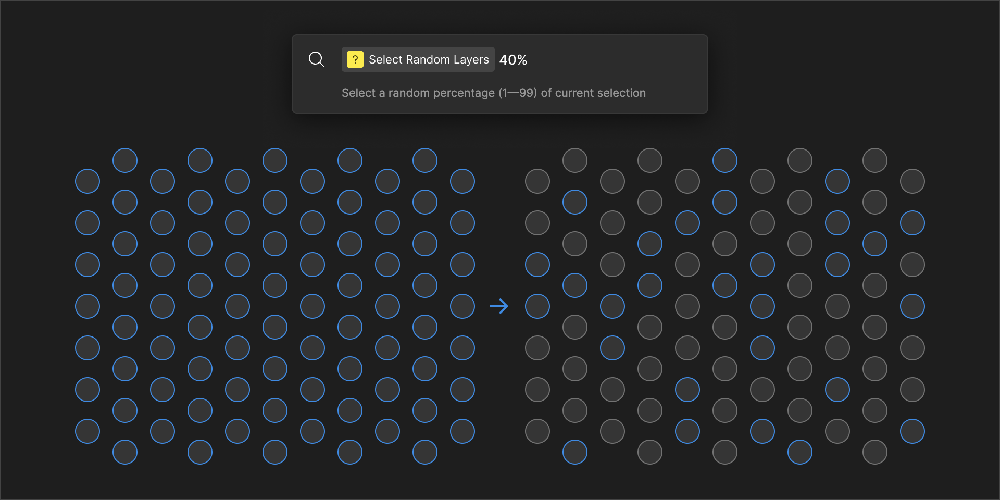

# Select Random Layers - Figma Plugin
Quick action to select a random subset of your current selection. Takes a percentage as an input and selects that percent of the current number of selected items. For example, if you have 100 circles selected, and you run 'Select Random Layers > 40%', you are left with a random 40 of the original selection. Pretty simple.

*Note: If you only have only one layer selected, and that layer has children, running this action will select from the children.*

Icon inspired by [Yuan Qing Lim and his collection of utility plugins](https://www.figma.com/@yuanqing).

[Figma Plugin Page](https://www.figma.com/community/plugin/1227013202162788533)

